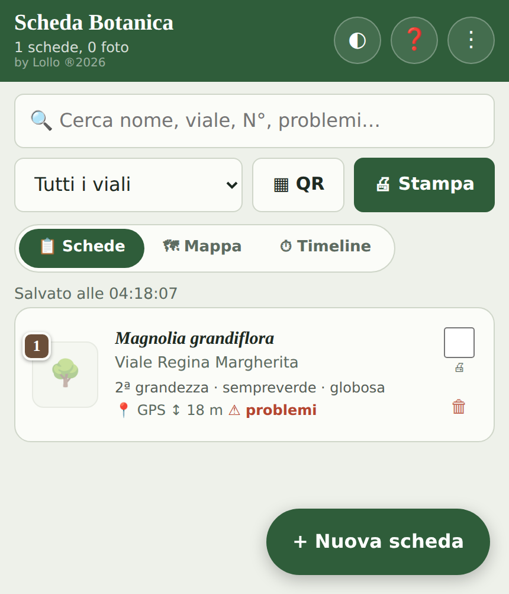
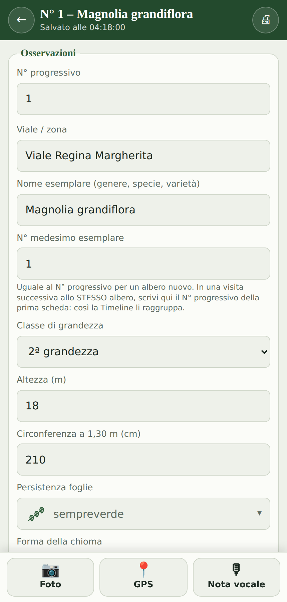
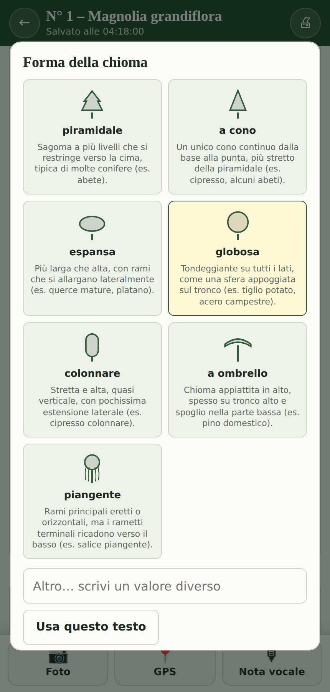
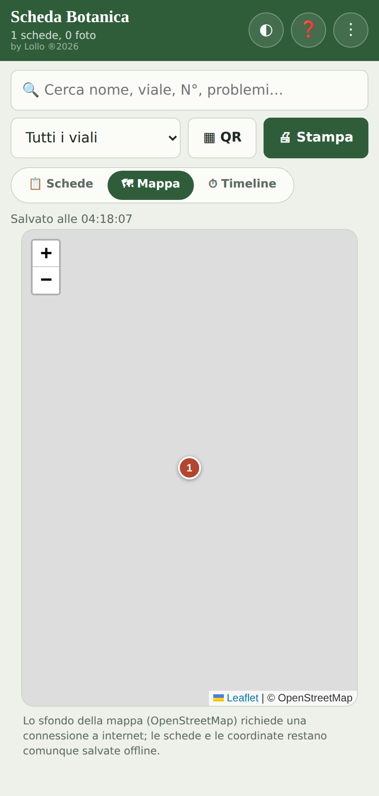

# 🌳 Scheda Botanica PRO

App **offline** per il rilievo botanico sul campo: schede per censire alberi con foto, GPS, note vocali, stima ambientale, stampa e backup — tutto in un unico file HTML, senza server e senza account.

**by Lollo ®2026**

---

## 📱 Prova l'app

👉 **[Apri Scheda Botanica PRO](https://baudinolorenzo73.github.io/scheda-botanica-pro/)** *(link attivo dopo aver pubblicato con GitHub Pages, vedi sotto)*

È una **PWA** (Progressive Web App): si può usare direttamente nel browser oppure installare sulla schermata home del telefono, e da quel momento funziona anche **senza connessione a internet**.

### Installarla sul telefono

- **Android (Chrome)** — apri il link, poi menu ⋮ → *Aggiungi a schermata Home* (o tocca il banner "Installa app" che compare da solo).
- **iPhone / iPad (Safari)** — apri il link, tocca l'icona di condivisione 􀈂, poi *Aggiungi a Home*.

Una volta installata si apre a schermo intero come un'app normale, con la sua icona.

---

## ✨ Funzionalità principali

- **Schede albero complete**: dati dendrometrici, botanici, pedologici e fitopatologici, con campi a scelta illustrata (icona + spiegazione per ogni valore) e campi che si adattano da soli — per esempio se scegli una foglia **aghiforme**, i campi lamina e margine non richiesti spariscono automaticamente.
- **Foto** (compresse in automatico) e **note vocali** direttamente sulla scheda.
- **GPS** con affinamento della precisione sotto la chioma.
- **Stima ambientale**: volume della chioma, ombra proiettata, CO₂ stoccata.
- **Riconoscimento specie** da foto con [PlantNet](https://plantnet.org) (chiave gratuita, opzionale).
- **Codice QR** per ogni scheda, per ritrovarla sul campo inquadrando un'etichetta.
- **Mappa** e **Timeline** (per confrontare più visite allo stesso albero).
- **Stampa** di una o più schede, anche solo come etichette QR.
- **Backup completo (.zip)**, import/export CSV, GeoJSON (QGIS), KML (Google Earth), GPX.
- **100% offline-first**: tutti i dati restano sul dispositivo (IndexedDB), nessun server coinvolto a parte le due funzioni facoltative (mappa e PlantNet).

## 🖼️ Screenshot

| Elenco schede | Compilazione scheda |
|---|---|
|  |  |

| Campo illustrato | Mappa |
|---|---|
|  |  |

## 📖 Manuali

Nella cartella [`manuali/`](manuali/):

- **[Manuale utente completo](manuali/manuale-utente.pdf)** ([.docx](manuali/manuale-utente.docx)) — guida capitolo per capitolo, con screenshot, glossario e indice analitico.
- **[Guida rapida](manuali/guida-rapida.pdf)** ([.docx](manuali/guida-rapida.docx)) — riepilogo pratico in una sola pagina.

## 🗂️ Struttura del repository

```
├── index.html              L'app (un unico file autonomo: HTML + CSS + JS)
├── manifest.json            Manifest PWA (nome, icone, colori)
├── service-worker.js        Cache offline dell'app shell
├── icons/                   Icone dell'app in varie dimensioni
├── manuali/                 Manuale utente e guida rapida (PDF + Word)
└── screenshot/               Immagini per questo README
```

## 🚀 Pubblicare / aggiornare su GitHub Pages

```bash
git add .
git commit -m "Aggiornamento app"
git push
```

Con **Settings → Pages → Deploy from branch → main / (root)** attivato, GitHub pubblica automaticamente il contenuto del repository all'indirizzo `https://<utente>.github.io/<nome-repo>/` a ogni push.

## 🔒 Privacy e dati

L'app non ha un server: i dati (schede, foto, audio) restano **solo sul dispositivo**, in un archivio locale del browser (IndexedDB). Le uniche connessioni verso l'esterno sono facoltative e attivate solo dall'utente: la cartina di sfondo (OpenStreetMap) e l'identificazione di una foto tramite PlantNet.

## 🧑‍💻 Tecnologie

File HTML singolo, senza framework né build: JavaScript nativo, [Leaflet](https://leafletjs.com) per la mappa (incluso nel file), IndexedDB per il salvataggio, Web Speech/MediaRecorder per l'audio, Geolocation API per il GPS.

## ⚖️ Licenza

Progetto personale — **by Lollo ®2026**.

---

<sub>Manuali e struttura PWA generati con l'aiuto di Claude.</sub>
