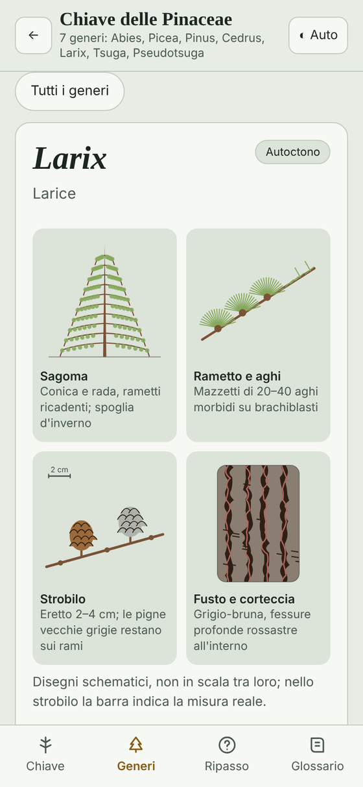
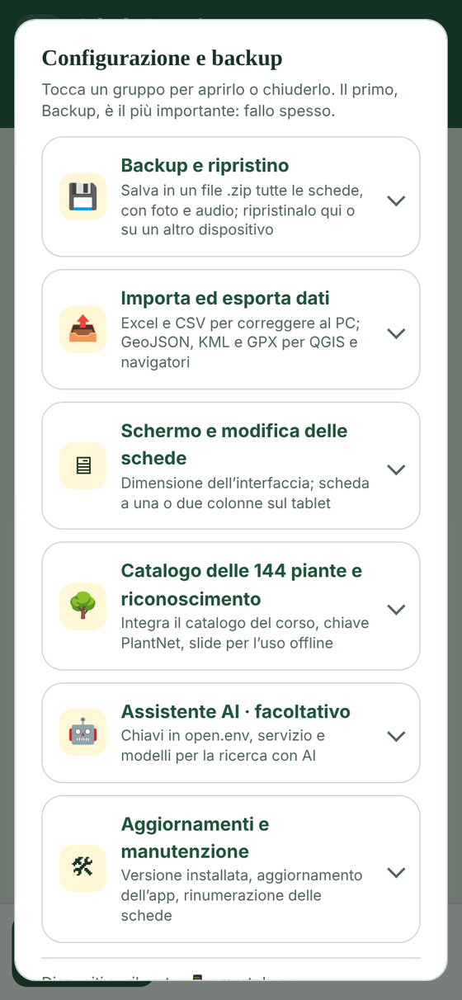
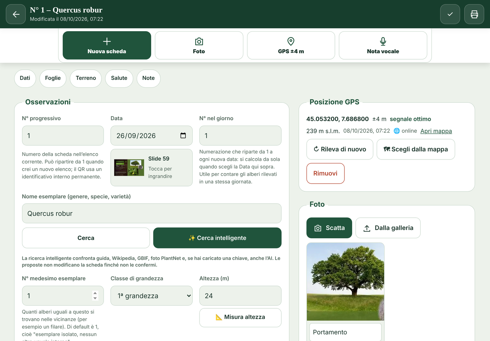

# 🌳 Scheda Botanica PRO

**App offline per il rilievo degli alberi sul campo**: schede con foto, GPS, note vocali, misura dell’altezza e stima ambientale; catalogo delle 144 piante del corso con le slide originali; Chiave delle Pinaceae; stampa, etichette QR, mappa e backup. Niente server, niente account: i dati restano sul dispositivo.

**by Lollo ®2026 — versione 3.46.0**

👉 **[Apri l’app](https://baudinolorenzo73.github.io/Scheda-botanica-pro/)** · [📘 Manuale utente (PDF)](manuali/manuale-utente.pdf) · [Guida rapida (PDF)](manuali/guida-rapida.pdf) · [Novità (CHANGELOG)](CHANGELOG.md) · [Assistente AI e chiavi](ASSISTENTE-AI.md)

| Prima pagina | Scheda | Chiave delle Pinaceae | Configurazione |
|---|---|---|---|
|  |  |  |  |

---

## Indice

- [Che cos’è](#che-cosè)
- [Installazione](#installazione)
- [Funzionalità](#funzionalità)
- [Documentazione](#documentazione)
- [Privacy e dati](#privacy-e-dati)
- [Struttura del repository](#struttura-del-repository)
- [Sviluppo e test](#sviluppo-e-test)
- [Pubblicare una nuova versione](#pubblicare-una-nuova-versione)
- [Tecnologie](#tecnologie)
- [Licenza](#licenza)

---

## Che cos’è

Scheda Botanica PRO nasce per il corso **«Gli alberi — Riconoscimento vegetale»** e serve a censire alberi in parchi, viali e giardini. Per ogni albero compili una scheda; a fine giornata stampi, esporti per Excel o QGIS e salvi un backup.

Tre principi guidano tutto il progetto:

1. **Offline prima di tutto.** Dopo la prima apertura con Internet funzionano senza rete schede, catalogo, slide, Chiave delle Pinaceae e mappa delle zone già viste.
2. **I dati restano sul dispositivo.** Archivio nel browser (IndexedDB), nessun server. Il backup .zip è il modo per conservarli e spostarli.
3. **Niente viene deciso al posto dell’utente.** Ricerche, PlantNet e AI propongono; nome e campi cambiano solo con una conferma esplicita, e i campi già compilati non vengono mai sovrascritti.

## Installazione

È una **PWA** (Progressive Web App): si usa dal browser o si installa sulla schermata Home.

- **Android (Chrome):** apri il link, poi menu ⋮ → *Aggiungi a schermata Home*.
- **iPhone / iPad (Safari):** apri il link, *Condividi* → *Aggiungi alla schermata Home*. Su iOS l’installazione è importante: Safari può cancellare i dati dei siti non usati per 7 giorni.

Aspetta che sotto il titolo compaia **«✓ offline pronta»**: da quel momento l’app lavora anche senza connessione.

## Funzionalità

### Sul campo
- **Schede albero** con dati dendrometrici, botanici, pedologici e fitopatologici. Salvataggio automatico, senza pulsante «Salva».
- **Blocco della scheda** 🔒: una scheda completata si consulta, si stampa e si esporta, ma non si modifica né si elimina finché non la sblocchi. Il blocco resta nel backup e protegge la scheda anche durante l’unione dei dati.
- **Campi illustrati**: persistenza, chioma, rami, crescita, gemme, foglia, lamina e margine si scelgono da disegni con spiegazione. Le foglie seguono la tabella «Caratteristiche distintive» del corso; i campi non pertinenti (per esempio il margine di un ago) spariscono da soli.
- **GPS** con affinamento della precisione sotto la chioma, valutazione del segnale e scelta manuale sulla mappa.
- **Quota del terreno** dal modello Copernicus DEM (90 m) via Open-Meteo, più affidabile della quota del GPS, e **località** proposta da OpenStreetMap (parco, via, comune) a partire dalle coordinate.
- **Foto** compresse automaticamente e **note vocali**.
- **Misura dell’altezza** con il telefono (inclinometro), da una foto o con l’ombra.
- **Stima ambientale** indicativa: volume della chioma, ombra proiettata, CO₂ stoccata.
- **Traccia GPS** del percorso con filtro dei punti imprecisi, esportabile in GPX.

### Riconoscere le piante
- **Catalogo delle 144 piante** del corso con slide originali, consultabile e integrabile offline; ricerca per nome, per caratteristiche e per zona d’origine.
- **Chiave delle Pinaceae**: chiave guidata dei 7 generi (*Abies, Picea, Pinus, Cedrus, Larix, Tsuga, Pseudotsuga*), schede con illustrazioni, slide del corso per genere, ripasso a domande e glossario. Collegata in entrambe le direzioni con il catalogo.
- **Stato di conservazione e nomi comuni**: categoria della Lista rossa IUCN e nomi comuni italiani dalla specie GBIF, salvati nella scheda.
- **Ricerche online**: Wikipedia/Wikidata e GBIF per verificare i nomi; **PlantNet** per nome e da foto (chiave gratuita); **assistente AI facoltativo** (Gemini, Groq, OpenRouter) con le chiavi in `open.env`. Le proposte vengono verificate su GBIF e richiedono conferma.

### Organizzare e condividere
- **Meteo e pollini** nell’app: previsione di 4 giorni con alba e tramonto e pollini di sei specie per l’Europa (Open-Meteo, CAMS), per la posizione attuale o una località cercata; resta il collegamento a 3B Meteo.
- **Ricerca, filtri** (specie, date, senza foto, senza GPS, con problemi), **Nuovo elenco** e **cestino** con svuotamento automatico.
- **Mappa** offline delle schede, stampa A4 della mappa e **pagina HTML mappa + schede** da aprire su qualsiasi dispositivo.
- **Stampa** di schede A4 (con prima pagina della mappa, QR, stima ambientale, foto e testo libero), **etichette QR 5×5 cm** e registro Excel.
- **Codice QR permanente** per ogni scheda e scansione per ritrovarla; **report per il cliente**.
- **Backup completo .zip** (schede, foto, audio, catalogo, cestino, traccia), backup automatico, cartella Download/Botanica, ripristino con **Sostituisci** o **Unisci** campo per campo per il lavoro in squadra; import Excel/CSV, export CSV, GeoJSON, KML, GPX.

### Interfaccia
- **? Aiuto** in testata, con ricerca (anche senza accenti), indice a etichette e 14 argomenti con esempi.
- **Configurazione in sei gruppi** comprimibili: Backup e ripristino · Importa ed esporta dati · Schermo e modifica · Catalogo e riconoscimento · Assistente AI · Aggiornamenti e manutenzione.
- Impaginazione adattiva per telefono, tablet (scheda a due colonne in orizzontale) e PC; tema chiaro/scuro; interfaccia ingrandibile.
- **Aggiornamenti controllati**: toccando la versione l’app confronta quella installata con `versione.json` pubblicato e aggiorna solo dopo conferma.



## Documentazione

Nella cartella [`manuali/`](manuali/):

- **[Manuale utente](manuali/manuale-utente.pdf)** ([.docx](manuali/manuale-utente.docx)) — 53 pagine in cinque parti (Iniziare · Sul campo · Riconoscere le piante · Organizzare e condividere · Impostazioni), con 31 schermate, esempi pratici, problemi frequenti, riferimento rapido, glossario e indice analitico.
- **[Guida rapida](manuali/guida-rapida.pdf)** ([.docx](manuali/guida-rapida.docx)) — tutto l’essenziale in una pagina.
- **[ASSISTENTE-AI.md](ASSISTENTE-AI.md)** — chiavi, servizi, modelli ed errori dell’assistente AI.
- **[CHANGELOG.md](CHANGELOG.md)** — le novità di ogni versione.

Nell’app, il pulsante **? Aiuto** contiene una versione breve del manuale, disponibile anche offline.

## Privacy e dati

L’app non ha un server: schede, foto, note vocali e coordinate restano **solo sul dispositivo** (IndexedDB) e nei backup creati dall’utente. Escono dal dispositivo soltanto, e solo quando si usa la funzione:

| Funzione | Dati inviati | Destinatario |
|---|---|---|
| Sfondo della mappa | la zona visualizzata | OpenStreetMap |
| Wikipedia, GBIF | il nome cercato | Wikimedia, GBIF |
| Stato IUCN e nomi comuni | l’ID GBIF della specie | GBIF |
| Quota del terreno | le coordinate della scheda | Open-Meteo |
| Località dalle coordinate | le coordinate della scheda (max 1 richiesta/s) | OpenStreetMap Nominatim |
| Meteo e pollini | la posizione attuale o il nome della località cercata | Open-Meteo |
| PlantNet | il nome, oppure la foto scelta | Pl@ntNet |
| Cerca con AI | nome e caratteri botanici (mai foto, GPS o note) | il servizio scelto |
| Proposte AI dal catalogo | la slide e la nota del corso | il servizio scelto |

Le chiavi AI stanno in `open.env`, che **non va mai** messo nello ZIP, in Drive o su GitHub: `.gitignore` lo esclude e `scripts/check_public_secrets.py` blocca la pubblicazione se trova un file `.env`.

## Struttura del repository

```
├── index.html               Struttura della pagina principale
├── pinaceae.html            Chiave delle Pinaceae (pagina autonoma, offline)
├── css/app.css              Stili e layout adattivo
├── app.js                   Avvio, archivio, scheda, GPS, configurazione, aiuto
├── js/
│   ├── config.js            Campi della scheda, dipendenze, versione
│   ├── utils.js             Funzioni di supporto e preferenze
│   ├── database.js          Archivio IndexedDB
│   ├── guida.js             Catalogo delle 144 specie, ricerche, AI
│   ├── ricerca-servizi.js   Servizi esterni (GBIF, PlantNet, AI) ed errori
│   ├── mappa.js             Mappa, tile offline, traccia GPS
│   ├── mappa-export.js      Stampa della mappa e pagina HTML mappa + schede
│   ├── stampa-qr.js         QR, scansione, stampa A4 ed etichette
│   ├── backup.js            Backup ZIP, ripristino, unione, Excel/CSV, esportazioni
│   ├── dati-aperti.js       GBIF (IUCN, nomi comuni), quota, località, meteo e pollini
│   └── altezza.js           Misura dell’altezza
├── icone.js                 Disegni dei campi illustrati
├── data/guida-specie.js     Dati delle 144 specie del corso
├── slides/                  Slide del corso (cache offline separata)
├── img/                     Immagini delle pagine (schema delle Pinaceae)
├── lib/                     Leaflet, JSZip, xlsx-populate, generatore QR
├── icons/                   Icone dell’app
├── manifest.json            Manifest PWA
├── service-worker.js        Cache offline dell’app, delle slide e della mappa
├── versione.json            Versione pubblicata, letta da «Controlla aggiornamenti»
├── manuali/                 Manuale utente e guida rapida (PDF + Word)
├── screenshot/              Immagini di questo README
├── scripts/versione.py      Cambia la versione in tutti i file insieme
├── scripts/check_public_secrets.py  Blocca la pubblicazione di file .env
├── tests/                   Prove automatiche (npm test)
└── CHANGELOG.md             Novità di ogni versione
```

JavaScript nativo, senza framework e senza build: i file del repository sono esattamente quelli pubblicati.

## Sviluppo e test

Servono Node.js e Chromium.

```bash
npm install
npx playwright install chromium     # oppure CHROMIUM_PATH=/percorso/chromium
npm test
```

`npm test` esegue nove gruppi di prove:

| File | Che cosa verifica |
|---|---|
| `tests/versione.cjs` | stessa versione in config.js, versione.json, package.json e README |
| `tests/search-services.cjs` | ricerche e servizi esterni simulati, senza contattare Internet |
| `tests/browser.cjs` | flussi principali dell’app nel browser |
| `tests/resilience.cjs` | note vocali con permesso negato; aggiornamento della PWA senza perdere le schede offline |
| `tests/altezza-mappa.cjs` | misura dell’altezza, foglia composta, stampa della mappa e pagina HTML |
| `tests/pinaceae.cjs` | Chiave delle Pinaceae, slide e collegamenti con il catalogo |
| `tests/interfaccia.cjs` | configurazione a gruppi, Aiuto con indice e ricerca, testata da 320 a 1600 px |
| `tests/blocco.cjs` | blocco della scheda: campi spenti, niente eliminazione, sblocco con conferma, unione dei backup |
| `tests/dati-aperti.cjs` | GBIF (IUCN, nomi comuni), quota del terreno, località con limite di 1 richiesta/s, meteo e pollini, con risposte simulate |

## Pubblicare una nuova versione

Il numero di versione compare in più file e deve essere uguale ovunque, altrimenti «Controlla aggiornamenti» non trova la versione nuova.

1. Nella cartella del progetto: `python scripts/versione.py` mostra la versione attuale in ogni file.
2. `python scripts/versione.py 3.45.0` (con il numero nuovo) aggiorna `js/config.js`, `versione.json`, `package.json`, questo README e alza il numero della cache del service worker, così i dispositivi scaricano i file nuovi.
3. Aggiungi in cima a `CHANGELOG.md` cosa è cambiato.
4. Pubblica. Con lo script Termux `pubblica` (opzione 1) partendo dallo ZIP del progetto nella cartella di Google Drive; oppure a mano:

```bash
git add .
git commit -m "Versione 3.45.0"
git push
```

GitHub Pages pubblica il contenuto del branch principale all’indirizzo `https://baudinolorenzo73.github.io/Scheda-botanica-pro/`. Attendi che il deploy su GitHub Actions sia verde, poi tocca la versione nell’app per aggiornarla.

## Tecnologie

JavaScript nativo · IndexedDB · Service Worker e Cache API · [Leaflet](https://leafletjs.com) con tile OpenStreetMap · Geolocation, MediaRecorder, DeviceOrientation e File System Access API · JSZip · xlsx-populate · [GBIF](https://www.gbif.org) · [Pl@ntNet](https://my.plantnet.org) · [Open-Meteo](https://open-meteo.com) (meteo, pollini CAMS, quota Copernicus DEM GLO-90, [doi:10.5270/ESA-c5d3d65](https://doi.org/10.5270/ESA-c5d3d65)) · [Nominatim](https://nominatim.org) di OpenStreetMap · Playwright per i test.

## Licenza

Progetto personale — **by Lollo ®2026**. Le slide e i dati delle 144 specie provengono dal materiale del corso «Gli alberi — Riconoscimento vegetale».

---

<sub>Manuali, test e parte del codice realizzati con l’aiuto di Claude.</sub>
