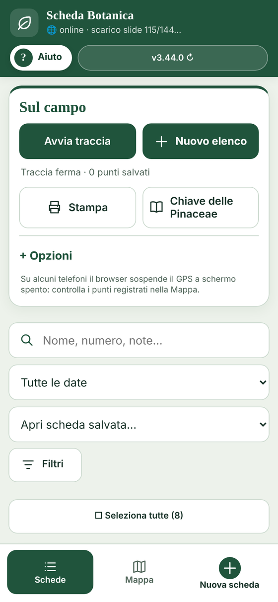
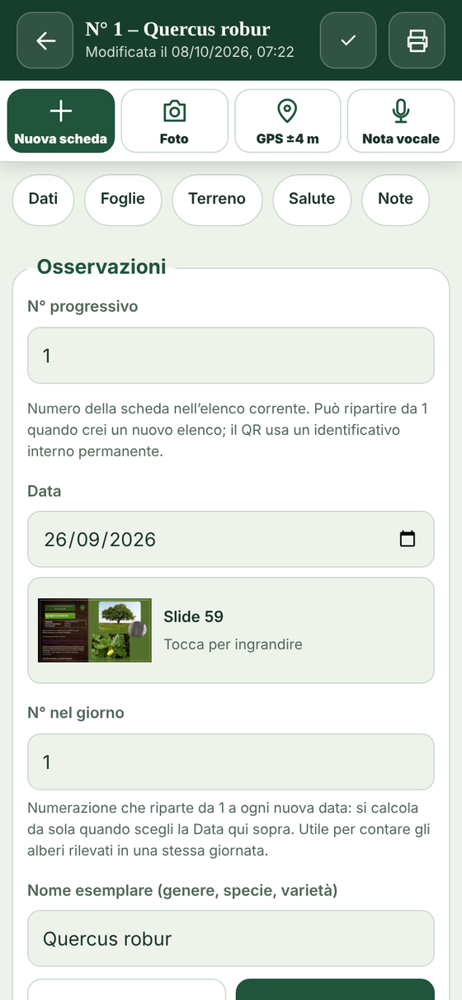
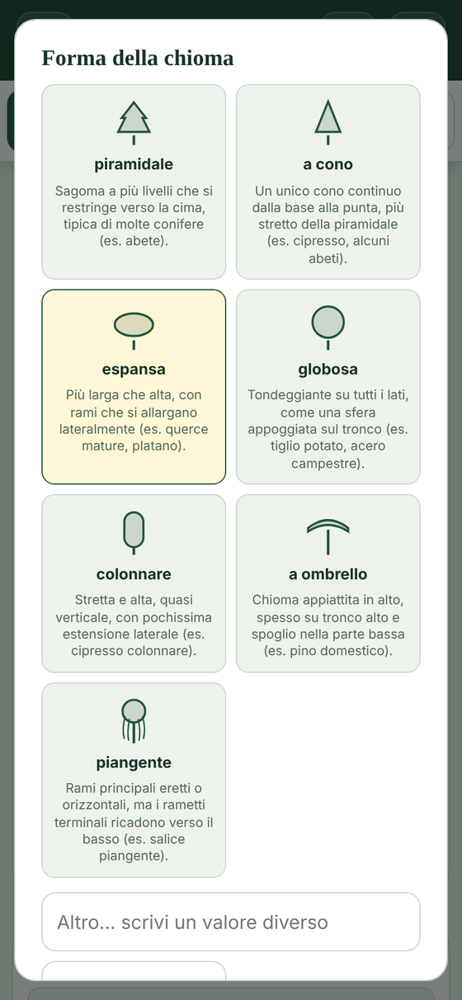
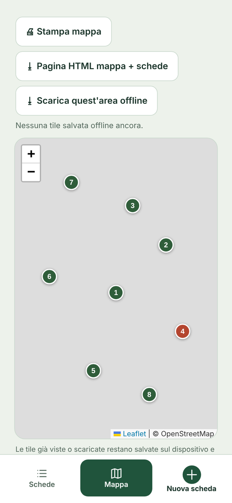

# 🌳 Scheda Botanica PRO

App **offline** per il rilievo botanico sul campo: schede per censire alberi con foto, GPS, note vocali, stima ambientale, stampa e backup, senza server e senza account.

**by Lollo ®2026 — versione 3.42.1**

[Novità e storico delle versioni](CHANGELOG.md) · [Guida all’AI e alle chiavi](ASSISTENTE-AI.md)

---

## 📱 Prova l'app

👉 **[Apri Scheda Botanica PRO](https://baudinolorenzo73.github.io/Scheda-botanica-pro/)** *(link attivo dopo aver pubblicato con GitHub Pages, vedi sotto)*

È una **PWA** (Progressive Web App): si può usare direttamente nel browser oppure installare sulla schermata home del telefono, e da quel momento funziona anche **senza connessione a internet**.

### Installarla sul telefono

- **Android (Chrome)** — apri il link, poi menu ⋮ → *Aggiungi a schermata Home* (o tocca il banner "Installa app" che compare da solo).
- **iPhone / iPad (Safari)** — apri il link, tocca l'icona di condivisione 􀈂, poi *Aggiungi a Home*.

Una volta installata si apre a schermo intero come un'app normale, con la sua icona.

---

## ✨ Funzionalità principali

- **Schede albero complete**: dati dendrometrici, botanici, pedologici e fitopatologici, con campi a scelta illustrata (icona + spiegazione per ogni valore) e campi che si adattano da soli — per esempio se scegli una lamina **aghiforme** o una foglia **a squame**, i campi non pertinenti spariscono automaticamente. Le foglie seguono la tabella «Caratteristiche distintive» (tipo, lamina, margine).
- **Foto** (compresse in automatico) e **note vocali** direttamente sulla scheda.
- **GPS** con affinamento della precisione sotto la chioma.
- **Stima ambientale**: volume della chioma, ombra proiettata, CO₂ stoccata.
- **Riconoscimento specie** da foto con [PlantNet](https://plantnet.org) (chiave gratuita, opzionale).
- **Codice QR permanente** per ogni scheda, per ritrovarla senza ambiguità anche dopo l’apertura di un nuovo elenco.
- **Ricerca immediata del nome** nel catalogo locale delle specie e nei nomi già registrati, utilizzabile anche offline. Il nome può essere inserito liberamente.
- **Comandi di ricerca della specie** raccolti sotto «Cerca» nel campo nome: Wikipedia/Wikidata, PlantNet, GBIF, foto, caratteristiche e zona d’origine. La ricerca Wikipedia considera i primi cinque risultati e mostra solo nomi tassonomici strutturati su Wikidata che GBIF classifica nel regno Plantae; se GBIF non risponde, non propone nomi non verificati. «Cerca auto» combina la guida locale con la verifica del nome e, se c’è una foto e la chiave PlantNet, l’identificazione da foto; mostra la provenienza e il significato di ogni percentuale senza sintetizzarle in una probabilità fittizia. La provenienza d’origine non dimostra la presenza locale. I dati già osservati non vengono sovrascritti e le discordanze vengono evidenziate.
- **Aggiornamenti controllati:** toccando la versione in alto a destra l’app confronta la versione installata con `versione.json` pubblicato. Se trova una versione più recente mostra il numero e chiede conferma prima di scaricarla; quando è pronta compare «Aggiorna ora». Schede e dati locali non vengono cancellati.
- **Foto, GPS e nota vocale** sempre accessibili in alto nell’editor, anche mentre scorri la scheda.
- **Catalogo integrabile** in Configurazione: sfoglia le 144 pagine originali, aggiungi le caratteristiche mancanti e registra la fonte; le integrazioni hanno un editor viola distinto dalle schede di rilievo. Trasferisci solo le integrazioni o il catalogo completo delle 144 piante in JSON, oppure includi le integrazioni nel backup ZIP di schede, foto e audio.
- **Azioni in prima pagina**: «Nuova scheda» resta sempre visibile nella barra inferiore; avvio/pausa/stop della traccia GPS e «Nuovo elenco» sono nel riquadro «Sul campo»; «+ Opzioni» raccoglie meteo 3B Meteo, QR, stampa, backup, cestino, guida e tema. In Configurazione si può scegliere la dimensione dell’interfaccia.
- **Nuove schede senza nomi automatici**: la data è quella odierna e «Nome esemplare» resta vuoto. Nessuna etichetta `Prova…` viene generata o visualizzata, neppure per le vecchie schede. Se si torna indietro senza inserire alcun dato reale, la bozza non viene memorizzata.
- **PlantNet per nome dentro l’app**: il pulsante interroga il catalogo ufficiale per prefisso scientifico; i nomi comuni sono risolti tramite Wikipedia quando necessario. Richiede la chiave PlantNet. Il collegamento alla scheda esterna è un comando separato. Le caratteristiche sono confrontate nella guida locale o con l’AI, non con un inesistente motore testuale PlantNet.
- **AI con recupero dai modelli non disponibili**: modelli diversi per testo e immagini; per i predefiniti Gemini/Groq un errore 404 avvia il controllo del catalogo ufficiale e una sola riprova nello stesso servizio. Modelli e servizio si configurano da Configurazione. Non c’è passaggio automatico fra provider o scelta arbitraria di modelli OpenRouter.
- **Nuovo elenco** dalla prima schermata: scarica un backup delle schede correnti e le sposta nel cestino, poi riparte dalla scheda numero 1.
- **Mappa offline** e registrazione del percorso con filtro dei punti GPS imprecisi ed esportazione GPX.
- **Stampa** di una o più schede, anche solo come etichette QR.
- **Backup completo (.zip)** con ripristino protetto di schede, cestino, foto, audio, catalogo e traccia; import/export CSV, GeoJSON, KML e GPX. Nei browser che supportano File System Access puoi autorizzare Download e l’app crea/usa la sottocartella `Botanica`. Prima spiega lo scopo e chiede conferma; il permesso riguarda esclusivamente la cartella scelta. Negli altri browser usa il download normale.
- **100% offline-first**: tutti i dati restano sul dispositivo (IndexedDB), archivio locale; alcune funzioni consultano servizi esterni.

## 🖼️ Screenshot

| Elenco schede | Compilazione scheda |
|---|---|
|  |  |

| Campo illustrato | Mappa |
|---|---|
|  |  |

## 📖 Manuali

Nella cartella [`manuali/`](manuali/):

- **[Manuale utente completo](manuali/manuale-utente.pdf)** ([.docx](manuali/manuale-utente.docx)) — guida capitolo per capitolo, con screenshot, glossario e indice analitico.
- **[Guida rapida](manuali/guida-rapida.pdf)** ([.docx](manuali/guida-rapida.docx)) — riepilogo pratico in una sola pagina.

## 🗂️ Struttura del repository

```
├── index.html               Struttura della pagina
├── css/app.css              Stili e layout responsive
├── app.js                   Logica, archivio, GPS, backup e importazioni
├── js/                      Configurazione, utilità, database, ricerche e moduli:
│   ├── guida.js             guida delle 144 specie, catalogo, AI, ricerche web
│   ├── mappa.js             mappa, tile offline, traccia GPS
│   ├── stampa-qr.js         QR, scansione etichette, stampa A4
│   └── backup.js            backup ZIP, ripristino, unione, Excel/CSV, esportazioni
├── icone.js                 Disegni dei campi botanici
├── data/                    Guida locale alle 144 specie
├── slides/                  Slide del corso (scaricate anche per l'uso offline)
├── lib/                     Librerie incluse per mappa, QR, ZIP ed Excel
├── manifest.json            Manifest PWA (nome, icone, colori)
├── service-worker.js        Cache offline dell'app, delle slide e della mappa
├── versione.json            Versione pubblicata, letta da «Controlla aggiornamenti»
├── icons/                   Icone dell'app in varie dimensioni
├── manuali/                 Manuale utente e guida rapida (PDF + Word)
├── screenshot/              Immagini per questo README
├── scripts/versione.py      Cambia la versione in tutti i file in un colpo solo
├── scripts/check_public_secrets.py  Controlla che nessun file .env venga pubblicato
├── tests/                   Prove automatiche (npm test)
└── CHANGELOG.md             Novità di ogni versione
```

## 🔢 Pubblicare una nuova versione

Il numero di versione compare in più file e deve essere uguale ovunque, altrimenti il pulsante «Controlla aggiornamenti» non trova la versione nuova. Uno script lo cambia in tutti i file insieme.

1. Apri Termux ed entra nella cartella del progetto, per esempio: `cd ~/Scheda-botanica-pro`
2. Scrivi `python scripts/versione.py` e premi Invio: vedi la versione attuale in ogni file.
3. Scrivi `python scripts/versione.py 3.28.1` (con il numero nuovo) e premi Invio. Lo script aggiorna `js/config.js`, `versione.json`, `package.json`, questo README e alza di uno il numero della cache del service worker, così i telefoni scaricano i file nuovi.
4. Aggiungi in cima a `CHANGELOG.md` cosa è cambiato.
5. Pubblica come al solito con `pubblica`.

**Test (facoltativi, servono Node.js e Chromium):** `npm install`, poi `npx playwright install chromium`, poi `npm test`. Il solo controllo della versione si lancia con `node tests/versione.cjs` e non richiede il browser.

## 🚀 Pubblicare / aggiornare su GitHub Pages

```bash
git add .
git commit -m "Aggiornamento app"
git push
```

Con **Settings → Pages → Deploy from branch → main / (root)** attivato, GitHub pubblica automaticamente il contenuto del repository all'indirizzo `https://<utente>.github.io/<nome-repo>/` a ogni push.

## 🔒 Privacy e dati

L'app non ha un server: i dati (schede, foto, audio) restano **solo sul dispositivo**, in un archivio locale del browser (IndexedDB). La mappa contatta OpenStreetMap; l’identificazione richiesta invia una foto a PlantNet. La ricerca web consulta Wikipedia/Wikidata. Il collegamento tassonomico può consultare GBIF automaticamente dopo l’inserimento o l’apertura del nome di una specie. Questi servizi richiedono internet; l’archivio locale resta utilizzabile offline.

## 🧑‍💻 Tecnologie

JavaScript nativo senza framework né build, [Leaflet](https://leafletjs.com) per la mappa, IndexedDB per il salvataggio, MediaRecorder per l'audio e Geolocation API per il GPS.

## ⚖️ Licenza

Progetto personale — **by Lollo ®2026**.

---

<sub>Manuali e struttura PWA generati con l'aiuto di Claude.</sub>
